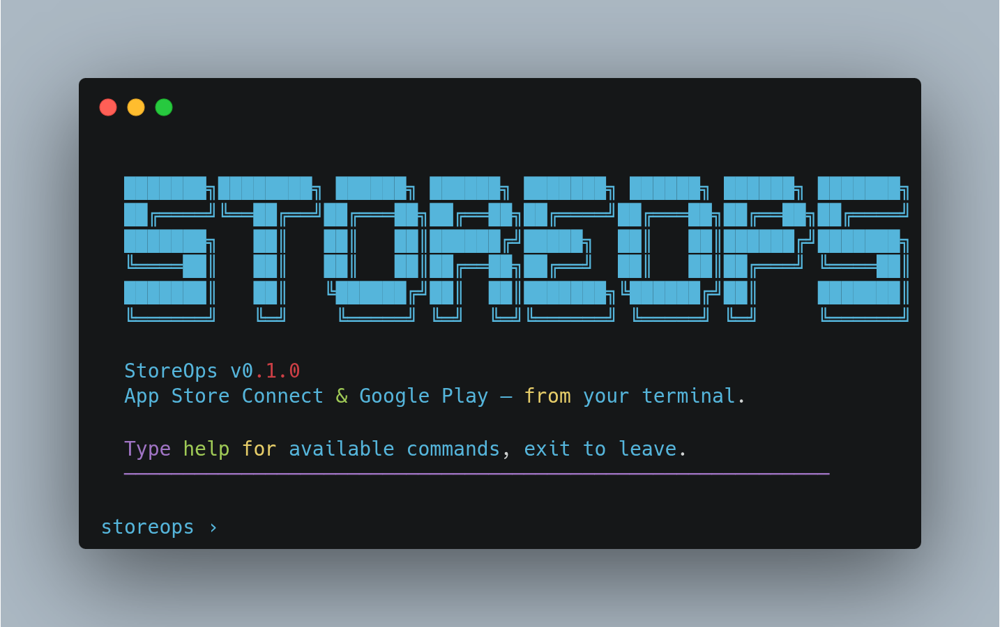

# StoreOps

**Manage the full App Store Connect and Google Play Store lifecycle from the command line.**

[](https://crates.io/crates/storeops)
[](LICENSE)
[](https://github.com/fbonesso/storeops/actions/workflows/ci.yml)
[](https://github.com/fbonesso/storeops/releases)



---

## Features

- **Metadata and listings** -- manage app descriptions, keywords, and localized store listings
- **Screenshots and previews** -- upload, reorder, and delete screenshots and app preview videos
- **Pricing and availability** -- configure pricing tiers, territory availability, and distribution
- **In-app purchases and subscriptions** -- create and manage IAPs, subscription groups, and offers
- **Reviews and ratings** -- fetch and respond to user reviews across both stores
- **TestFlight and testing tracks** -- manage beta groups, testers, and testing track assignments
- **Builds and submissions** -- list builds, submit for review, and monitor review status
- **Analytics and reports** -- pull sales, download, and crash analytics data
- **Phased releases and age ratings** -- control rollout stages and age rating declarations
- **Agent-friendly by design** -- JSON output by default, no interactive prompts, explicit flags, clean exit codes

## Quick Start

```sh
curl -fsSL https://raw.githubusercontent.com/fbonesso/storeops/main/install.sh | sh

storeops auth init
storeops auth login --store apple --key-id XXXX --issuer-id XXXX --key-path /path/to/AuthKey.p8
storeops apple apps list
```

## Installation

### Install script (macOS, Linux)

```sh
curl -fsSL https://raw.githubusercontent.com/fbonesso/storeops/main/install.sh | sh
```

This detects your OS and architecture, downloads the latest release, and installs `storeops` to `/usr/local/bin`.

To install a specific version or to a custom directory:

```sh
STOREOPS_VERSION=v0.1.0 STOREOPS_INSTALL_DIR=~/.local/bin \
  curl -fsSL https://raw.githubusercontent.com/fbonesso/storeops/main/install.sh | sh
```

### Pre-built binaries

Download directly from [GitHub Releases](https://github.com/fbonesso/storeops/releases):

| Platform | Architecture | Target |
|----------|-------------|--------|
| macOS | Apple Silicon | `aarch64-apple-darwin` |
| macOS | Intel | `x86_64-apple-darwin` |
| Linux | x64 | `x86_64-unknown-linux-gnu` |
| Linux | ARM64 | `aarch64-unknown-linux-gnu` |
| Windows | x64 | `x86_64-pc-windows-msvc` |

### Build from source

Requires [Rust](https://www.rust-lang.org/tools/install) toolchain:

```sh
git clone https://github.com/fbonesso/storeops.git
cd storeops
cargo build --release
cp target/release/storeops /usr/local/bin/
```

## Authentication

StoreOps supports both Apple App Store Connect and Google Play Store credentials.

### Apple (API Key)

You need an App Store Connect API key (.p8 file). Set the following environment variables or configure them in a profile:

```sh
export STOREOPS_APPLE_KEY_ID="XXXXXXXXXX"
export STOREOPS_APPLE_ISSUER_ID="xxxxxxxx-xxxx-xxxx-xxxx-xxxxxxxxxxxx"
export STOREOPS_APPLE_KEY_PATH="/path/to/AuthKey.p8"
```

### Google (Service Account)

Create a service account in the Google Play Console and download the JSON key file:

```sh
export STOREOPS_GOOGLE_SERVICE_ACCOUNT="/path/to/service-account.json"
```

### Profiles

You can configure multiple profiles in `~/.config/storeops/config.toml` and switch between them:

```sh
storeops auth init              # Interactive setup for a new profile
storeops auth switch production # Switch active profile
storeops auth status            # Show current auth status
```

## Usage

### Apple workflows

```sh
# List apps
storeops apple apps list

# Get app metadata
storeops apple metadata get --app-id 123456789

# Upload a screenshot
storeops apple screenshots upload --app-id 123456789 --locale en-US --display-type APP_IPHONE_67 --file screenshot.png

# Submit a build for review
storeops apple submit --app-id 123456789 --build-number 42

# Check review status
storeops apple versions list --app-id 123456789

# Manage TestFlight beta testers
storeops apple testflight groups list --app-id 123456789
storeops apple testflight testers add --app-id 123456789 --group-id G1 --email user@example.com

# Start a phased release
storeops apple phased-release enable --app-id 123456789 --version-id V1

# List in-app purchases
storeops apple iap list --app-id 123456789

# Fetch analytics
storeops apple analytics get --app-id 123456789 --metric downloads --start 2025-01-01 --end 2025-01-31
```

### Google workflows

```sh
# List apps
storeops google apps list

# Update a store listing
storeops google listings update --package com.example.app --locale en-US --title "My App"

# Upload a build to a track
storeops google builds upload --package com.example.app --track internal --file app.aab

# Promote to production
storeops google submit --package com.example.app --track production --build-number 42

# Read reviews
storeops google reviews list --package com.example.app

# Fetch sales reports
storeops google reports sales --package com.example.app --month 2025-01
```

### Output formats

```sh
# JSON (default)
storeops apple apps list

# Table format
storeops apple apps list --output table

# Markdown
storeops apple apps list --output markdown

# Pretty-print JSON
storeops apple apps list --pretty

# Paginate through all results
storeops apple reviews list --app-id 123456789 --paginate
```

## Agent Integration

StoreOps is designed to be used by AI agents and automation pipelines:

- **JSON output by default** -- all commands emit structured JSON to stdout, ready for parsing
- **No interactive prompts** -- every parameter is an explicit flag; no TTY required
- **Clean exit codes** -- 0 for success, non-zero for errors with JSON error details on stderr
- **Deterministic pagination** -- use `--limit`, `--next`, and `--paginate` for predictable data retrieval
- **Timeout control** -- `--timeout` flag prevents hanging in automated environments
- **Agent Skills compatible** -- can be wrapped as a tool in agent frameworks (Claude Code, LangChain, etc.)

Example agent usage:

```sh
# An agent can reliably parse the output
APPS=$(storeops apple apps list --output json)
APP_ID=$(echo "$APPS" | jq -r '.[0].id')
storeops apple reviews list --app-id "$APP_ID" --limit 10 --output json
```

## Command Reference

```
storeops
|
+-- auth
|   +-- init           Initialize configuration and credentials
|   +-- login          Validate credentials and authenticate
|   +-- switch         Switch active profile
|   +-- status         Show current authentication status
|
+-- apple
|   +-- apps           List and get app details
|   +-- versions       List and manage app versions
|   +-- builds         List builds and build details
|   +-- testflight     Manage beta groups and testers
|   +-- submit         Submit a build for App Store review
|   +-- reviews        List and respond to reviews
|   +-- devices        List registered devices
|   +-- analytics      Fetch app analytics and metrics
|   +-- metadata       Get and update app metadata
|   +-- screenshots    Upload, list, reorder, and delete screenshots
|   +-- previews       Upload, list, and delete app preview videos
|   +-- pricing        Get and update pricing configuration
|   +-- age-rating     Get and update age rating declarations
|   +-- phased-release Enable, pause, resume, and complete phased releases
|   +-- iap            List, create, and manage in-app purchases
|   +-- subscriptions  Manage subscription groups and offers
|   +-- availability   Configure territory availability
|
+-- google
|   +-- apps           List and get app details
|   +-- tracks         List and manage release tracks
|   +-- builds         Upload and list builds
|   +-- testers        Manage internal and external testers
|   +-- submit         Promote builds to a track
|   +-- reviews        List and reply to reviews
|   +-- reports        Fetch sales, installs, and crash reports
|   +-- listings       Get and update store listings
|   +-- images         Upload and manage store images
|   +-- inapp          Manage in-app products
|   +-- availability   Configure country availability
|
+-- Global flags
    --output json|table|markdown    Output format (default: json)
    --pretty                        Pretty-print JSON output
    --profile <name>                Use a specific auth profile
    --limit <n>                     Limit number of results
    --next <token>                  Pagination cursor
    --paginate                      Automatically fetch all pages
    --timeout <ms>                  Request timeout in milliseconds
    --verbose                       Enable verbose logging
```

## Configuration

StoreOps stores its configuration at:

```
~/.config/storeops/config.toml
```

Example configuration:

```toml
[default]
output = "json"
pretty = false
timeout = 30000

[profiles.personal]
apple_key_id = "XXXXXXXXXX"
apple_issuer_id = "xxxxxxxx-xxxx-xxxx-xxxx-xxxxxxxxxxxx"
apple_key_path = "/path/to/AuthKey.p8"

[profiles.work]
apple_key_id = "YYYYYYYYYY"
apple_issuer_id = "yyyyyyyy-yyyy-yyyy-yyyy-yyyyyyyyyyyy"
apple_key_path = "/path/to/WorkKey.p8"
google_service_account = "/path/to/service-account.json"
```

## Contributing

Contributions are welcome.

```sh
git clone https://github.com/fbonesso/storeops.git
cd storeops
cargo build
cargo test
cargo clippy -- -D warnings
```

1. Fork the repository
2. Create a feature branch
3. Ensure `cargo test` and `cargo clippy` pass
4. Open a pull request

## License

MIT -- see [LICENSE](LICENSE) for details.
